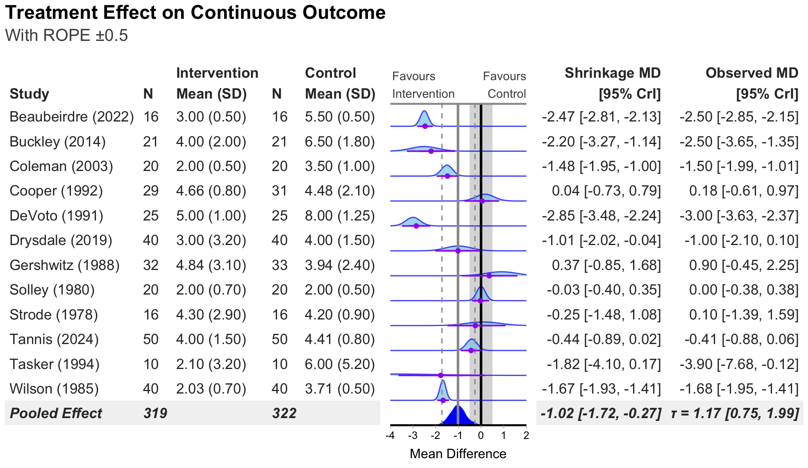
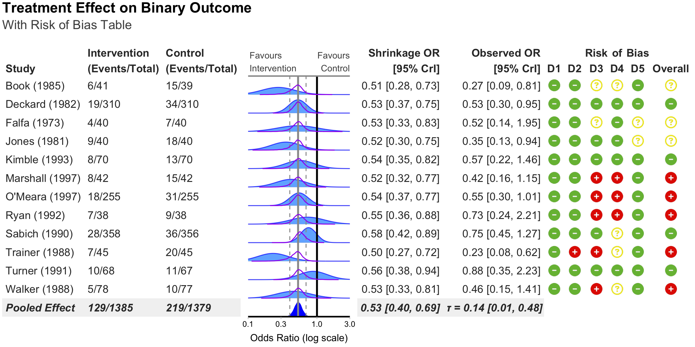

<!-- README.md is generated from README.Rmd. Please edit that file -->

```{r chunk options, include = FALSE}
knitr::opts_chunk$set(
  collapse = TRUE,
  comment = "#>",
  fig.path = "man/figures/",
  out.width = "100%"
)
```

# bayesfoRest: Forest Plots for Bayesian Meta Analyses in R 

<!-- badges: start -->
<!-- badges: end -->

## Overview

bayesfoRest is an R package for creating publication-ready forest plots from Bayesian meta-analyses. It provides a comprehensive solution for visualizing meta-analytic results with support for various effect measures, subgroup analyses, and risk of bias assessments.

## Key Features

- **Bayesian Forest Plots**: Create forest plots from brms models with customizable aesthetics
- **Multiple Effect Measures**: Support for OR, HR, RR, IRR, MD, and SMD
- **Subgroup Analysis**: Built-in support for subgroup meta-analyses
- **Risk of Bias Integration**: Seamlessly incorporate risk of bias assessments (RoB2, ROBINS-I, ROBINS-E, QUADAS-2)
- **Shrinkage Visualisation**: Display shrinkage effects with density plots or point intervals
- **ROPE Support**: Add Region of Practical Equivalence (ROPE) to plots
- **Extensive Customisation**: Colours, fonts, labels, and layout

## Installation

You can install the development version of bayesfoRest from GitHub:

```r
# install.packages("devtools")
devtools::install_github("BLMoran/bayesfoRest")
```

## Basic Usage

### Binary Outcome Forest Plot (Odds Ratio)
```{r example, eval=FALSE}
bayes_forest(
  model = model_bin,
  data = binary_outcome,
  measure = "OR",
  xlim = c(0.1, 3.5)
)
```


### Add Subgroups

```r

bayes_forest(
  model = model_bin,
  data = binary_outcome,
  measure = "OR",
  subgroup = T,
  xlim = c(0.1, 3.5)
)
```



### Subgroup Analysis

```r
# Using binary outcome data with subgroups based on surgical type

# Create subgroup forest plot
forest_plot_subgroup <- bayes_forest(
  model = model_bin,
  data = binary_outcome,
  measure = "OR",
  subgroup = T,
  studyvar = Author,
  year = Year,
  c_n = N_Control,
  i_n = N_Intervention,
  c_event = Event_Control,
  i_event = Event_Intervention,
  title = "Treatment Effect on Binary Outcome",
  subtitle = "By Surgical Cohort",
  label_intervention = "Treatment",
  label_control = "Control",
  xlim = c(0.1, 3.5)
)

forest_plot_subgroup
```


### Risk of Bias Integration: RoB Columns

```r
# Create forest plot with RoB
forest_plot_rob <- bayes_forest(
  model = model_bin,
  data = binary_outcome,
  measure = "OR",
  studyvar = Author,
  year = Year,
  c_n = N_Control,
  i_n = N_Intervention,
  c_event = Event_Control,
  i_event = Event_Intervention,
  title = "Treatment Effect on Binary Outcome",
  subtitle = "With Risk of Bias Table",
  add_rob = TRUE,
  rob_tool = "rob2"
)

forest_plot_rob
```


### Risk of Bias Integration: RoB Legend
```r
# Create forest plot with RoB
forest_plot_rob <- bayes_forest(
  model = model_bin,
  data = binary_outcome,
  measure = "OR",
  studyvar = Author,
  year = Year,
  c_n = N_Control,
  i_n = N_Intervention,
  c_event = Event_Control,
  i_event = Event_Intervention,
  title = "Treatment Effect on Binary Outcome",
  subtitle = "With Risk of Bias Table",
  add_rob = TRUE,
  add_rob_legend = TRUE,
  rob_tool = "rob2"
)

forest_plot_rob
```


### Standalone Risk of Bias Plot

```r
# Create standalone RoB visualization
rob_visualization <- rob_plot(
  data = binary_outcome,
  studyvar = Author,
  sort_studies_by = "year",
  rob_tool = "rob2",
  add_rob_legend = TRUE,
  title = "Risk of Bias Assessment",
  subtitle = "Cochrane RoB 2 Tool"
)

rob_visualization
```


## Citation

If you use bayesfoRest in your research, please cite:

```
@Manual{,
  title = {bayesfoRest: Forest Plots for Bayesian Meta-Analyses},
  author = {[Benjamin Moran and Thomas Payne]},
  year = {2025},
  note = {R package version 0.0.0.9000},
  url = {https://github.com/BLMoran/bayesfoRest},
}
```

## Dependencies

bayesfoRest depends on several R packages:

- [brms](https://paulbuerkner.com/brms/) for Bayesian model fitting
- [metafor](https://wviechtb.github.io/metafor/index.html) for meta-analysis preparation
- [gt](https://gt.rstudio.com) for creating tables
- [patchwork](https://patchwork.data-imaginist.com) for combining plots
- [ggplot2](https://ggplot2.tidyverse.org) for plotting
- [ggdist](https://mjskay.github.io/ggdist/) for density plotting
- [tidybayes](https://mjskay.github.io/tidybayes/index.html) for tidy workflow
- [dplyr](https://dplyr.tidyverse.org), [tidyr](https://tidyr.tidyverse.org), [purrr](https://purrr.tidyverse.org) for data manipulation
- [paletteer](https://emilhvitfeldt.github.io/paletteer/) for colour palettes
- [fontawesome](https://rstudio.github.io/fontawesome/) for risk of bias icons

## Contributing

Contributions are welcome! Please feel free to submit a Pull Request.

## License

This package is licensed under the AGPL (>= 3) License.

## Acknowledgments

bayesfoRest builds upon the excellent work of the [brms](https://paulbuerkner.com/brms/) , [metafor](https://wviechtb.github.io/metafor/index.html), [gt](https://gt.rstudio.com), [patchwork](https://patchwork.data-imaginist.com), [ggdist](https://mjskay.github.io/ggdist/), [tidybayes](https://mjskay.github.io/tidybayes/index.html) and the [tidyverse](https://www.tidyverse.org) suite of packages. Without the work of the R community and their contributions, bayesfoRest would not be possible.