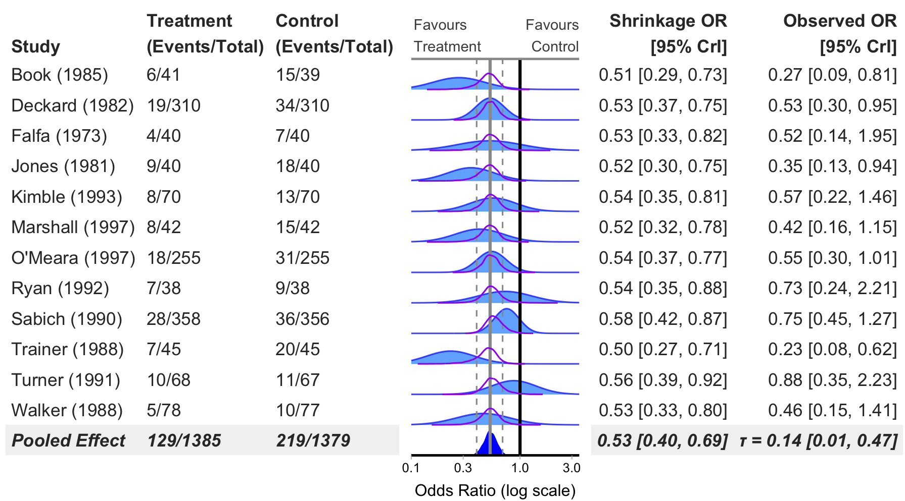
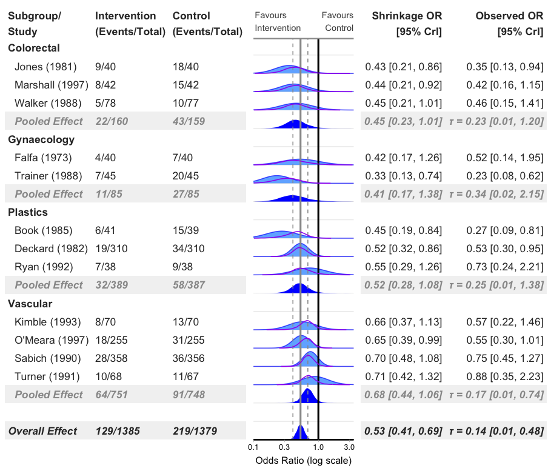
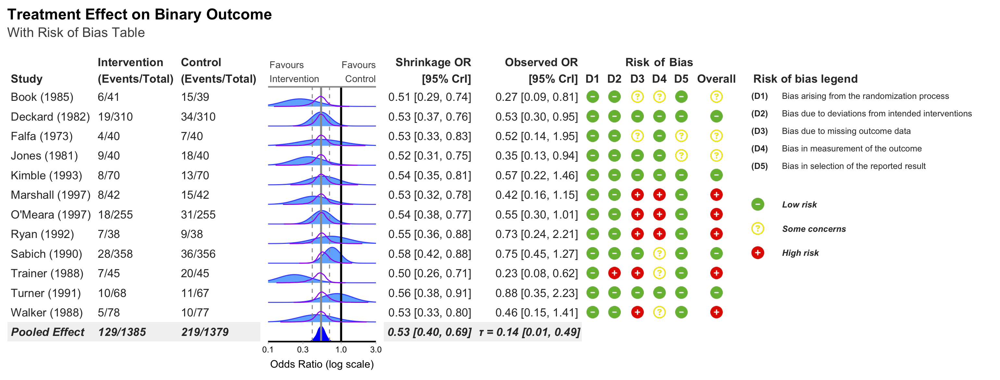
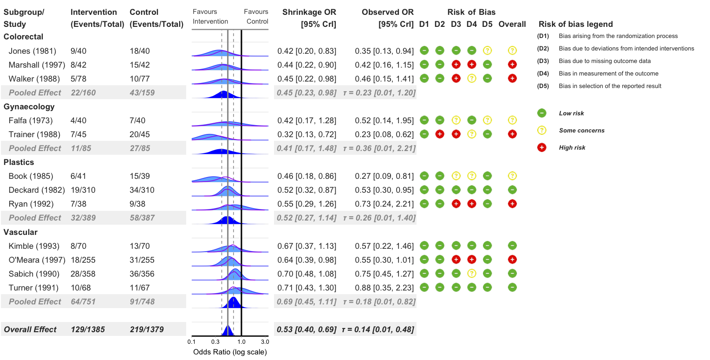
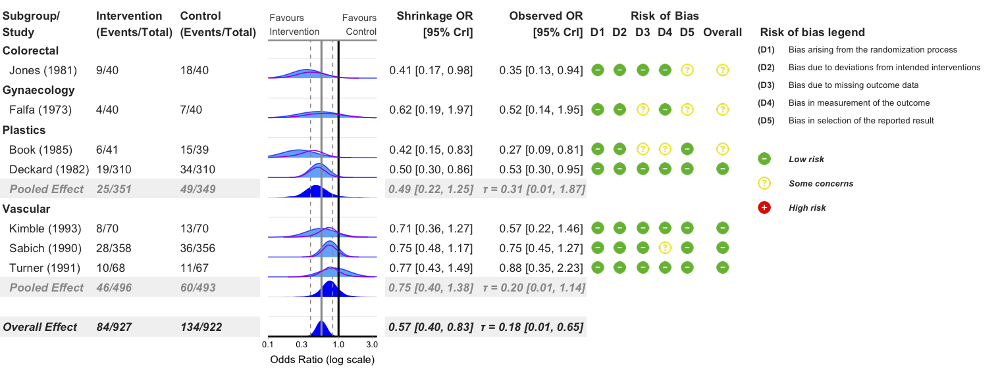
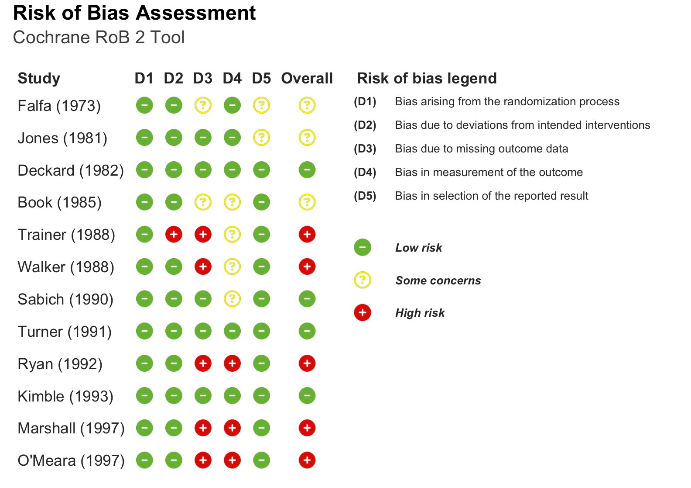

<!-- README.md is generated from README.Rmd. Please edit that file -->

```{r chunk options, include = FALSE}
knitr::opts_chunk$set(
  collapse = TRUE,
  comment = "#>",
  fig.path = "man/figures/",
  out.width = "100%"
)
```

# bayesfoRest: Forest Plots for Bayesian Meta Analyses in R 

<!-- badges: start -->
<!-- badges: end -->

## Overview

bayesfoRest is an R package for creating publication-ready forest plots from Bayesian meta-analyses. It provides a comprehensive solution for visualizing meta-analytic results with support for various effect measures, subgroup analyses, and risk of bias assessments.

## Key Features

- **Bayesian Forest Plots**: Create forest plots from brms models with customizable aesthetics
- **Multiple Effect Measures**: Support for OR, HR, RR, IRR, MD, and SMD
- **Subgroup Analysis**: Built-in support for subgroup meta-analyses
- **Risk of Bias Integration**: Seamlessly incorporate risk of bias assessments (RoB2, ROBINS-I, ROBINS-E, QUADAS-2)
- **Shrinkage Visualisation**: Display shrinkage effects with density plots or point intervals
- **ROPE Support**: Add Region of Practical Equivalence (ROPE) to plots
- **Extensive Customisation**: Colours, fonts, labels, and layout

## Installation

You can install the development version of bayesfoRest from GitHub:

```r
# install.packages("devtools")
devtools::install_github("BLMoran/bayesfoRest")
```

## Basic Usage

### Binary Outcome Forest Plot (Odds Ratio)
```{r example, eval=FALSE}
bayes_forest(
  model = model_bin,
  data = binary_outcome,
  measure = "OR",
  xlim = c(0.1, 3.5)
)
```



### Add Subgroups

```r
bayes_forest(
  model = model_bin,
  data = binary_outcome,
  measure = "OR",
  subgroup = T,
  xlim = c(0.1, 3.5)
)
```



### Add Risk of Bias Columns

```r
bayes_forest(
  model = model_bin,
  data = binary_outcome,
  measure = "OR",
  subgroup = T,
  add_rob = T,
  xlim = c(0.1, 3.5)
)
```


### Add Risk of Bias Legend
```r
bayes_forest(
  model = model_bin,
  data = binary_outcome,
  measure = "OR",
  subgroup = T,
  add_rob = T,
  add_rob_legend = T,
  rob_tool = "rob2",
  xlim = c(0.1, 3.5)
)
```


### Exclude Studies with High Risk of Bias
```r
bayes_forest(
  model = model_bin,
  data = binary_outcome,
  measure = "OR",
  subgroup = T,
  add_rob = T,
  add_rob_legend = T,
  rob_tool = "rob2",
  exclude_high_rob = T,
  xlim = c(0.1, 3.5)
)
```


### Standalone Risk of Bias Plot

```r
# Create standalone RoB visualization
rob_plot(
  data = binary_outcome,
  rob_tool = "rob2",
  add_rob_legend = TRUE
)
```


## Citation

If you use bayesfoRest in your research, please cite:

```
@Manual{,
  title = {bayesfoRest: Forest Plots for Bayesian Meta-Analyses in R},
  author = {[Benjamin Moran and Thomas Payne]},
  year = {2025},
  note = {R package version 0.0.0.9000},
  url = {https://github.com/BLMoran/bayesfoRest},
}
```

## Dependencies

bayesfoRest depends on several R packages:

- [brms](https://paulbuerkner.com/brms/) for Bayesian model fitting
- [metafor](https://wviechtb.github.io/metafor/index.html) for meta-analysis preparation
- [gt](https://gt.rstudio.com) for creating tables
- [patchwork](https://patchwork.data-imaginist.com) for combining plots
- [ggplot2](https://ggplot2.tidyverse.org) for plotting
- [ggdist](https://mjskay.github.io/ggdist/) for density plotting
- [tidybayes](https://mjskay.github.io/tidybayes/index.html) for tidy workflow
- [dplyr](https://dplyr.tidyverse.org), [tidyr](https://tidyr.tidyverse.org), [purrr](https://purrr.tidyverse.org) for data manipulation
- [paletteer](https://emilhvitfeldt.github.io/paletteer/) for colour palettes
- [fontawesome](https://rstudio.github.io/fontawesome/) for risk of bias icons

## Feedback, Issues and Contributing

We welcome feedback, suggestions, issues and contributions. Please feel free to contact either <a href="mailto:ben.moran@newcastle.edu.au">Ben</a> or <a href="mailto:tompayne302@gmail.com">Tom</a> with any feedback. For any bugs, please file it [here](https://github.com/BLMoran/bayesfoRest/issues) with a minimal code example to reproduce the issue. Pull requests can be made [here](https://github.com/BLMoran/bayesfoRest/pulls).  Please note that the bayesfoRest project is released with a [Contributor Code of Conduct](https://github.com/BLMoran/bayesfoRest/CODE_OF_CONDUCT.html). By contributing to this project, you agree to abide by its terms.

## License

This package is licensed under the GPL-3 License.

## Acknowledgments

bayesfoRest builds upon the excellent work of the [brms](https://paulbuerkner.com/brms/) , [metafor](https://wviechtb.github.io/metafor/index.html), [gt](https://gt.rstudio.com), [patchwork](https://patchwork.data-imaginist.com), [ggdist](https://mjskay.github.io/ggdist/), [tidybayes](https://mjskay.github.io/tidybayes/index.html) and the [tidyverse](https://www.tidyverse.org) suite of packages. Without the work of the R community and their contributions, bayesfoRest would not be possible.